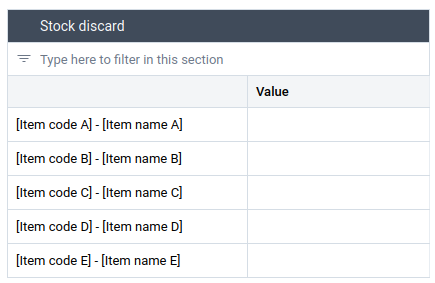

# LMIS System Design Document

## Background and Purpose

The LMIS System Design document provides an overview of the design principles and guidance for the World Health Organization (WHO) DNA (Data and Analytics) digital toolkit.
This document is intended for use by DHIS2 implementers at all levels to provide support for adapting and implementing the toolkit.

The toolkit was designed as simply and intuitively as possible and according to best supply chain practices to maximize usability and minimize training requirements. Therefore, user interfaces, displaying only essential information, are kept as simple as possible and are intuitive and easy to use. At the same time DHIS2 allows easily adding any additional data fields which may be required without requiring any programming skills.
The toolkit aims to provide all important stock data required for managing medical supplies at health facilities while limiting the workload of health workers and storekeepers in collecting and managing stocks. While the toolkit is compatible with desktop versioning, it is specifically designed and recommended for use on mobile devices, such as tablets or smartphones, for efficient stock data collection.

### Purpose and Use

Medical stores are usually replenished once a month from district, provincial or national stores. Upon delivery, they receive a detailed packing list for each consignment which provides details of the item codes and descriptions, quantities, batch numbers and expiry dates. After counting the quantity of each item, goods are put away and placed in order of the item group, within the item groups alphabetically by non-proprietary name and within by expiry date in the medical store.
Traditionally, medical stores are managed by recording each transaction in a batch card which is placed on the shelves next to each item. At the end of the month, the stock of each item is physically counted, the actual balance is compared with the running balance indicated in the batch card and, if necessary, the balance is corrected. All transactions of each batch card are summarized in a stock card which is also kept for each item among others for calculating the stock balance from all stock receipts and stock issues. The data on monthly stock issues as well as the stock on hand at the end of the month are then used for calculating monthly replenishment orders which closes the replenishment cycle.
The LMIS toolkit is intended for collecting, recording, reporting, storing, sharing and analysing monthly stock data from the "last mile" at health facilities (service delivery points) such as primary healthcare clinics or hospitals. It can also be used to manage any kind of medical stocks of drug products (tablets, injectable drug products, diagnostic tests etc.) as well as single use medical devices such as syringes, bandages, catheters, drains, x-ray films etc.
The Data entry form for the respective health facility is opened at the end of the month and the stock data is entered into the respective data fields for each of the managed healthcare products.

The contents and layout of the toolkit is designed to serve as a (minimum) standard for any health programme and for any type of healthcare goods, drug products as well as single use medical devices (such as syringes, compresses or catheters). This standardization removes the need to configure and customize LMIS modules for each individual HMIS toolkit. It also enables the management of all healthcare products within a single toolkit, eliminating the complexity of handling program stocks across multiple, separate stock data applications. Nevertheless, the layout, data fields and c ontents can be easily modified, customised and adapted to national or sub-national requirements and according to national guidelines, policies and reporting procedures.

As HMIS data will also be collected in DHIS2, triangulation of health and stock data, their analysis and visualisation is easy.

### Intended Users

This LMIS toolkit is designed and intended for any health staff managing medical stocks at the "last mile", health facilities or other service delivery points such as:
- community health workers
- immunisation workers
- medical storekeepers
- supervisors and medical store managers
- program managers
Health facilities will use the LMIS toolkit for recording, editing, sharing and analysing stock data. Supervisors, program managers and data analysts will use the LMIS toolkit for various analysis as well as for monitoring data use and data quality.

## System Design Overview

### Package Structure

| Dataset                     | Description                                                                                              |
|-----------------------------|----------------------------------------------------------------------------------------------------------|
| LMIS - Monthly stock report | Monthly dataset. Reports monthly stock transactions (receipt, distribution, discard) and stock position. |

### Dataset Details

The LMIS toolkit consists of a single Data set with a corresponding Data entry form.

The "LMIS - Monthly stock report" Data set lists the catalogue of medical products which are regularly used at health facilities and the Data entry form indicates all the selected Data elements.
Users can maintain a single Data set for the entire country or configure additional Data sets for individual health programmes (malaria, tuberculosis, immunisation etc.) or for different levels of care. For example separate Data sets for community health, primary health care or hospital care.
The tabular Data entry form lists all the healthcare products included in the Data set in the left, vertical column, of each of the four sections in alphabetical order of their names (descriptions),
The second, right column allows to record, and edit, the respective numeric values which can only assume the value of zero or positive integer values. All quantities of all healthcare goods should always be indicated in units of measure (UoM) of "EA" (Each) and not in any packaging quantities which may differ between manufacturers and change over time. "EACH" refers to the smallest usable unit of a healthcare product such as one tablet, one syringe or one disposable glove.
Each of the three transactions (receipt, distribution and discard) as well as the stock position are rendered as a separate section:

#### Stock receipt

The table was configured with individual data elements.

#### Stock distribution

The table was configured with individual data elements.

#### Stock discard

The table was configured with individual data elements.

#### Stock on hand

The table was configured with individual data elements.

These sections are considered as the indispensable, minimum data which has to be collected and managed in any medical store but can easily be extended by adding other data fields.

### Data Elements

Data elements represent the healthcare products which are regularly managed and replenished in medical stores at health facilities
The toolkit contains five placeholder items such as "[Item code A] - [Item name A]" which determine and exemplify the structure of Data elements and the way they appear in the Data set. These placeholders need to be replaced by healthcare products according to the National Essential Medicines List with their exact non-proprietary names and the main specifications. These should indicate the non-proprietary name, strength (concentration) and dosage form (tablet, capsule, injection etc.) for drug products and the name and essential specifications for single use drug products.
Data elements can be easily added to DHIS2 and can be easily added to and removed from any Data set as required.

## Analytics and Indicators

This chapter provides only a summary of the preconfigured visualisations and dashboards which can be used for extended and adding for analytics. All indicators are essential and meaningful for logistics and supply chain management. The details for each of the indicators and visualisations are provided in the extensive LMIS "Data Quality and Data use" which includes the explanation of all indicators in great detail.
For details please refer to the Implementation guidance chapter on [Data Quality and Data Use](https://docs.dhis2.org/en/implement/logistics/data-quality-and-data-use.html).

The indicators, analytics and visualisations are based on the following statistics (stock data) and logistics performance data:

Stock data
- Stock receipt
- Stock distribution
- Stock discard
- Stock on hand

Logistics performance data
- Stock coverage time
- Stockouts
- Stockout count
- Stock availability / %
- Stockout percentage / %
- Stock availability and stockout percentage
- Maps

The visualisations and dashboards have two main objectives. First providing an overview of current and post stock data from the monthly reports such as stock issues or stock on hand. Secondly to provide essential and meaningful logistics performance data which indicates the quality of stock management and provided logistics services.
DHIS2 natively allows filtering any visualisation by Organisation Unit (health facility) as well as any administrative level such as districts, regions or at the country level. Furthermore, the time period of any of the visualisations can be modified by any user.

## Dashboards

- LMIS - National level - Visualisation library
- LMIS - Sub-national level - Visualisation library
- LMIS - Facility level - Visualisation library
- LMIS - Health facility level - Analytics

## User groups

| User group          | Dashboard         | Metadata          | Data                 |
|---------------------|-------------------|-------------------|----------------------|
| LMIS - Admin        | Can edit and view | Can edit and view | Can view only        |
| LMIS - Access       | Can view only     | Can view only     | Can view only        |
| LMIS - Data capture | No access         | Can view only     | Can capture and view |
